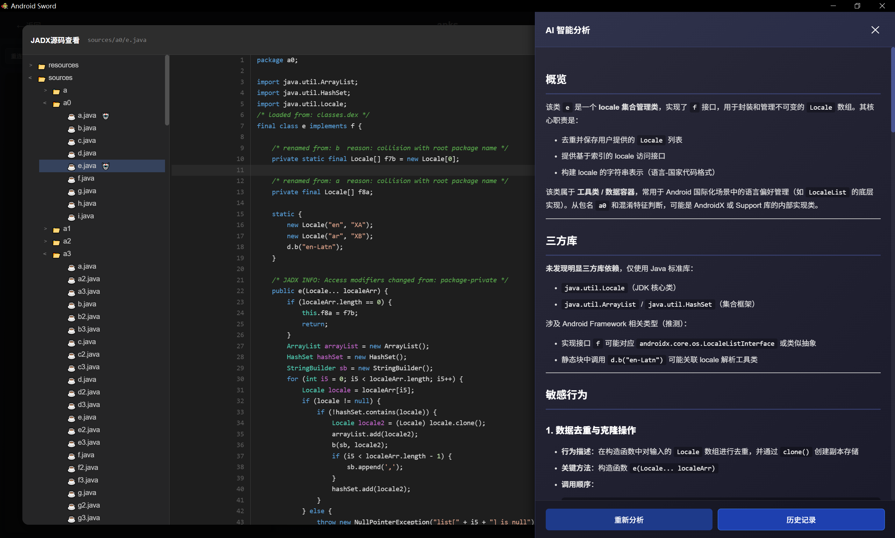
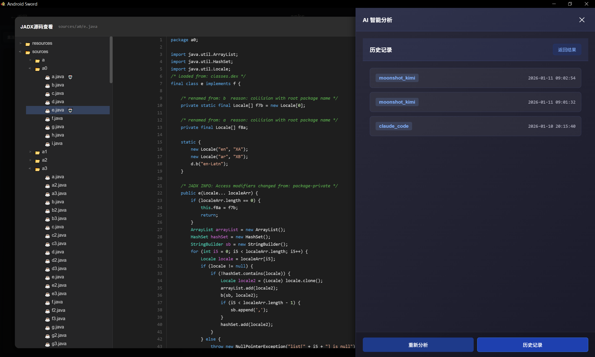
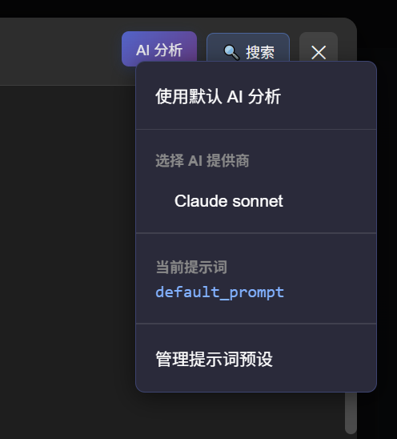
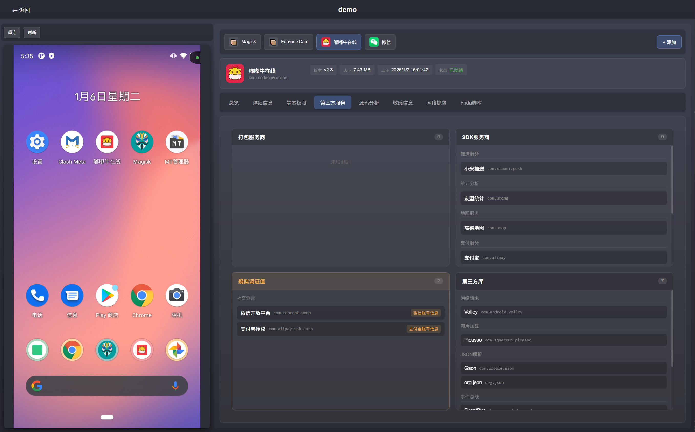
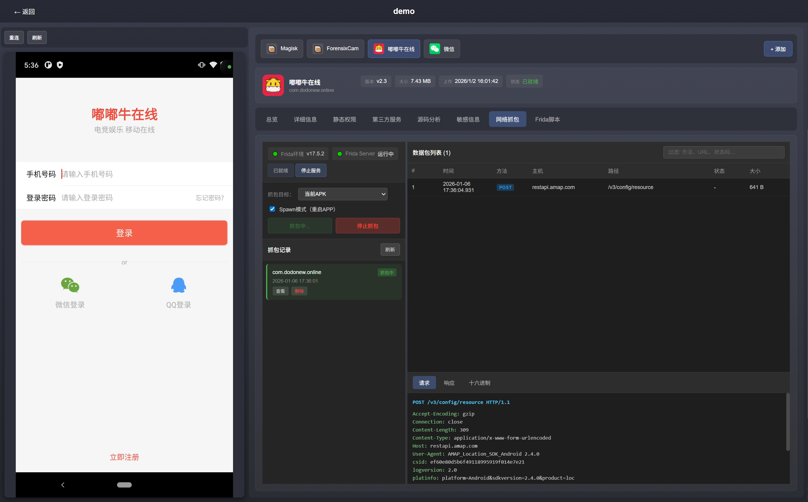
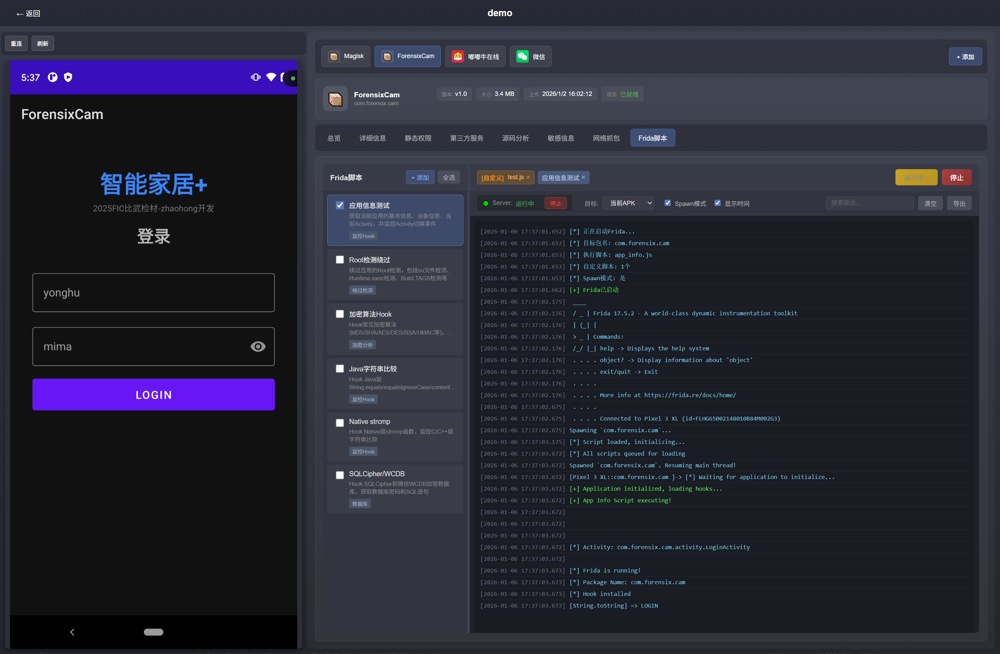

# Android Sword

一款开源的apk一体化分析工具

  
  
  

License: GNU General Public License v3.0

  <a href="./LICENSE">完整许可证文本</a>

### 演示视频：

画质不高，将就着看(\*^▽^\*)

https://github.com/user-attachments/assets/924670bc-db51-48db-86c4-8b651792d01a

***更新说明：未来六个月除了修复现有Bug（请提issue），不会新增更多功能或模块***

**新增：AI源码分析**需要自己配置api_key

目前支持：Claude（电脑上须安装Claude Code CLI），Kimi，Deepseek，OpenAI，智谱AI。

Claude和Kimi已测试过，后面几个还没测试（因为没申请api_key）

在`源码分析` -> `JADX源码查看 `中，点击一个代码文件之后，能看到右上角有一个`AI分析`按钮，直接点击后，可以使用`设置`界面配置好的默认AI工具直接分析，有AI分析记录的会在文件名边上显示一个[robot]的emoji。

如果使用不同ai进行多次分析，则可以点击历史记录查看：

右键`AI分析`按钮可以切换当前分析的AI工具、切换预设提示词等操作

管理提示词预设：`sources`目录下的源码分析默认使用`default_prompt`，`resources`目录中的默认使用`general_prompt`进行分析，还可以自行添加预设列表，添加预设时请注意让ai使用***markdown***格式回复，以便更好的渲染在前端。

### 各模块总览

**总览：**

**详细信息：**

**静态权限：**

**源码分析：**

**敏感信息：**

**第三方服务：**

**网络抓包(r0capture)**

**Frida脚本：**

